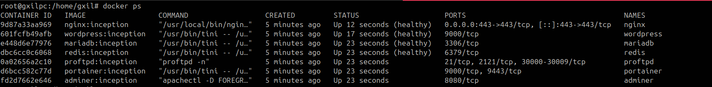
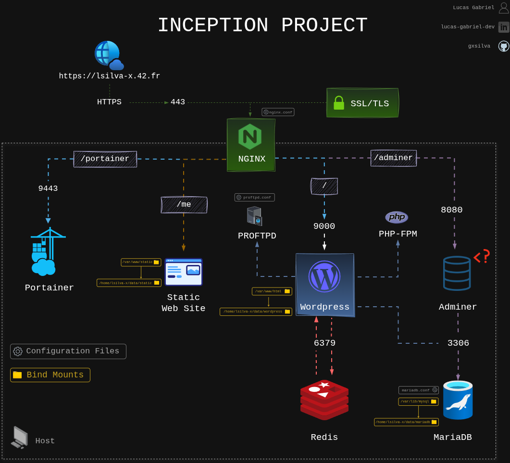

# 🐳 42SP_Inception

A project to create a cluster of Docker containers orchestrated with Docker Compose, simulating a production environment.

This project aims to provide a hands-on experience with containerization and orchestration using Docker and Docker Compose.

## 🛡️ Badges

[](https://github.com/gxsilva/42SP_Inception/blob/main/LICENSE)
[](https://github.com/gxsilva/42SP_Inception/stargazers)
[](https://github.com/gxsilva/42SP_Inception/network/members)
[](https://github.com/gxsilva/42SP_Inception/issues)
[](https://github.com/gxsilva/42SP_Inception/pulls)
[](https://github.com/gxsilva/42SP_Inception/commits/main)


## 📋 Table of Contents

- [📖 About](#📖about)
- [✨ Features](#✨features)
- [🎥 Demo](#🎥demo)
- [🚀 Quick Start](#🚀quick-start)
- [📦 Installation](#📦installation)
- [🧭 Usage](#🧭usage)
- [⚙️ Configuration](#⚙️configuration)
- [📁 Project Structure](#📁project-structure)
- [🚀 Deployment](#🚀deployment)
- [❓ FAQ](#❓faq)
- [💬 Support](#💬support)
- [🌟 Acknowledgments](#🌟acknowledgments)

## 📖About

This project is designed to help users understand and implement containerization and orchestration using Docker and Docker Compose. It sets up a multi-container environment that simulates a real-world production deployment. The project is particularly useful for students, developers, and system administrators who want to gain hands-on experience with these technologies.

The primary goal is to create a fully functional, containerized infrastructure using Docker Compose. This includes setting up various services such as web servers, databases, and monitoring tools, all running in separate containers. The project emphasizes best practices for container management, networking, and security.

Key technologies used in this project include Docker, Docker Compose, and Shell scripting for automation. The architecture involves defining services in a `docker-compose.yml` file, which Docker Compose uses to build and run the containers. The project also includes scripts for setting up the environment, managing containers, and performing common tasks. The unique selling point of this project is its comprehensive approach to creating a production-like environment from scratch, providing a valuable learning experience.

## ✨Features

- 🎯 **Multi-Container Setup**: Orchestrates multiple Docker containers using Docker Compose.
- ⚡ **Automated Deployment**: Uses Shell scripts to automate the setup and deployment process.
- 🔒 **Network Configuration**: Configures network settings for container communication.
- 🛠️ **Customizable**: Allows users to customize the configuration to fit their specific needs.
- 🐳 **Production-Like Environment**: Simulates a real-world production deployment for hands-on experience.
- 📚 **Educational**: Provides a practical learning experience for Docker and Docker Compose.

## 🎥Demo

Since this project sets up a local Docker environment, a live demo is not applicable. However, here are some screenshots to illustrate the setup and usage:

### Screenshots


*Terminal output showing Docker Compose bringing up the containers*


*Terminal output showing the running Docker containers*

## 🚀Quick Start

> ⚠️ **Warning:** The passwords stored in the `/secrets` directory are intended solely for academic demonstration purposes. These credentials are not secure and must never be used in any production environment.

Clone the repository and start the environment using Docker Compose:

```bash
git clone https://github.com/gxsilva/42SP_Inception.git
cd 42SP_Inception
make all
```

This will build and start all the defined services in foreground mode.

## 📦Installation

### Prerequisites

- Docker Engine (version 20.10 or later)
- Docker Compose (version 2.40 or later)
- Git
- Make (optional, for convenience)

### Steps

1.  **Clone the repository:**

```bash
git clone https://github.com/gxsilva/42SP_Inception.git
cd 42SP_Inception
```

2.  **Install dependencies (if any):**

This project primarily uses Docker and Docker Compose, so no additional dependencies need to be installed manually. Docker Compose will handle building and pulling the necessary images.

3.  **Configure environment variables (if needed):**

Check the `docker-compose.yml` file and any associated `secrets` files for required secrets variables. Create a `./secrets` folder in the root directory and populate it with the necessary values.

4.  **Start the environment:**

If it is in the root folder
```bash
make all
```
Or if it is at the same level as docker-compose.yml
```bash
docker compose up -d
```
`-d` to detached mode or without anything to check the logs in `foreground mode`

This command will build and start all the services defined in the `docker-compose.yml` file.

## 🧭Usage

After the installation, you can access the services running in the containers. The specific URLs and ports will depend on the configuration in the `docker-compose.yml` file.

### Example

If you have a web server running on port `80/8080/443`, you can access it by opening your web browser and navigating to `http://localhost`.

To stop the environment:

```bash
docker compose down
```

This command will stop and remove all the containers defined in the `docker-compose.yml` file.

## ⚙️Configuration

### Secrets Variables

You can configure the project using secrets variables. Create a `./secrets` folder in the root directory of the project and define the variables there.

```txt
# Example ./secrets/wordpress_admin_password.txt
654321
```

These variables can then be used in the `docker-compose.yml` file to configure the services.

## 📁Project Structure

```
├── LICENSE
├── Makefile
├── README.md
├── secrets
│   ├── db_password.txt
│   ├── db_root_password.txt
│   ├── portainer_password.txt
│   ├── vsftpd_user_password.txt
│   └── wordpress_admin_password.txt
└── srcs
    ├── docker-compose.yml
    └── requirements
        ├── bonus
        │   ├── adminer/
        │   ├── portainer/
        │   ├── proftpd/
        │   ├── redis/
        │   └── static/
        ├── mariadb/
        ├── nginx/
        ├── tools/
        └── wordpress/
```

## 📐Project Scheme
The project scheme provides a visual overview of the containerized infrastructure and how the different services interact within the environment.



*Project diagram made for greater abstraction of the structure*

## 🤝Contributing

We welcome contributions! Please see our [Contributing Guide](CONTRIBUTING.md) for details.

### Quick Contribution Steps

1.  🍴 Fork the repository
2.  🌟 Create your feature branch (`git checkout -b feature/AmazingFeature`)
3.  ✅ Commit your changes (`git commit -m 'Add some AmazingFeature'`)
4.  📤 Push to the branch (`git push origin feature/AmazingFeature`)
5.  🔃 Open a Pull Request

### Development Setup

```bash
# Fork and clone the repo
git clone https://github.com/yourusername/42SP_Inception.git

# Install dependencies (if any)
# Usually not needed for Docker-based projects

# Create a new branch
git checkout -b feature/your-feature-name

# Make your changes and test
# Use docker compose up to test your changes

# Commit and push
git commit -m "Description of changes"
git push origin feature/your-feature-name
```
## 🧪Testing

This project relies on Docker Compose for testing the environment. You can use the `docker compose up` command to start the environment and verify that the services are running correctly.

To run tests within a container, you can use the `docker exec` command. For example:

```bash
docker exec -it <container_id> bash
```

This will open a bash shell inside the container, allowing you to run tests and debug the application.

## 🚀Deployment

This project can be deployed to various platforms that support Docker and Docker Compose. Here are some common deployment options:

-   **Local Machine**: You can deploy the project to your local machine using Docker Compose.
-   **Cloud Platforms**: You can deploy the project to cloud platforms such as AWS, Azure, or Google Cloud using their respective container orchestration services.
-   **Docker Swarm**: You can deploy the project to a Docker Swarm cluster.
-   **Kubernetes**: You can convert the Docker Compose configuration to Kubernetes manifests and deploy the project to a Kubernetes cluster.

## ❓FAQ

**Q: How do I update the containers?**

A: You can update the containers by pulling the latest images and restarting the environment:

```bash
docker compose pull
docker compose up -d --force-recreate
```

**Q: How do I access the logs of a container?**

A: You can access the logs of a container using the `docker logs` command:

```bash
docker logs <container_id>
```

**Q: How do I scale a service?**

A: You can scale a service using the `docker compose scale` command:

```bash
docker compose scale <service_name>=<number_of_replicas>
```

## 📄License

This project is licensed under the MIT License - see the [LICENSE](LICENSE) file for details.

### License Summary

-   ✅ Commercial use
-   ✅ Modification
-   ✅ Distribution
-   ✅ Private use
-   ❌ Liability
-   ❌ Warranty

## 💬Support
-   🐛 **Issues**: [GitHub Issues](https://github.com/gxsilva/42SP_Inception/issues)

## 🌟Acknowledgments

-   📚 **Libraries used**:
    -   [Docker](https://www.docker.com/) - Containerization platform
    -   [Docker Compose](https://docs.docker.com/compose/) - Tool for defining and running multi-container Docker applications
